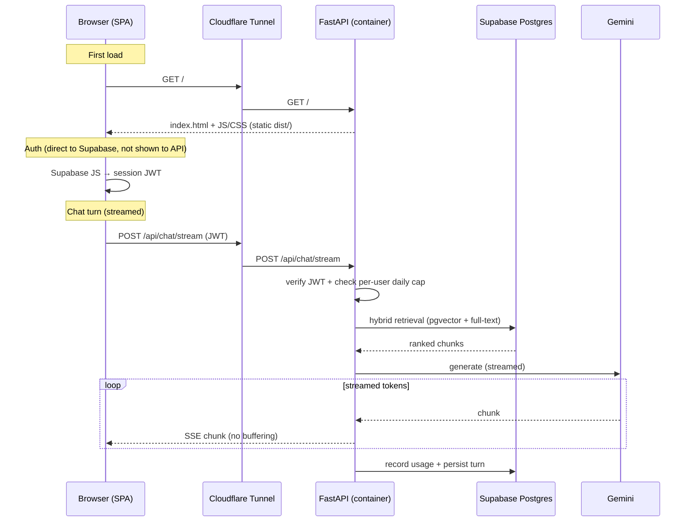

# Deployment Architecture — Single Container (Option A)

Status: **proposed** · Scope: **architecture only** (no implementation in this doc)

This describes how EdgarBrief is deployed for free, low-latency demo access so
potential clients and portfolio viewers can try it. It documents the chosen
**single-container** design and the reasoning behind it.

---

## Goal

Deploy the app so anyone can use it at a public URL with:

- **$0 hosting cost** — only the LLM (Gemini) costs money, and that is bounded.
- **Low latency** for a demo.
- **Per-user API limits** so one viewer cannot drain the Gemini budget.

## What actually needs hosting

Most of the stack is already managed and off-machine:

| Concern        | Where it lives                          | Cost                     |
| -------------- | --------------------------------------- | ------------------------ |
| Postgres + pgvector + full-text | Supabase (managed)         | Free tier                |
| Auth           | Supabase Auth                           | Free tier                |
| LLM + embeddings | Google Gemini API                     | **Paid** (bounded below) |
| Frontend       | Static bundle (`vite build` → `dist/`)  | Free (served by backend) |
| **Backend**    | FastAPI process — **the only thing that needs a running host** | Free (self-hosted) |

The React frontend is **static files**, not a server: the browser downloads
`dist/` and runs the JS. So the only long-running process to host is the
FastAPI backend.

---

## Decision: one container serves both frontend and API

A single Docker container runs **uvicorn/FastAPI**, which:

- serves the built React SPA (`dist/`) as static files at `/`
- serves the API under a path prefix on the **same origin**
- streams Gemini responses straight to the browser

The container runs on the existing self-hosted laptop and is exposed through the
**existing Cloudflare Tunnel** under one hostname (e.g. `edgarbrief.karankh.tech`).

### Why this design

- **One origin → no CORS.** Frontend and API share a scheme/host/port, so the
  CORS middleware becomes unnecessary.
- **One subdomain, one container, one process** — least to deploy and least to
  break during a live demo.
- **Streaming works with zero config** — there is no intermediate proxy between
  uvicorn and the browser to buffer the SSE stream. (Cloudflare Tunnel passes
  streaming through; it does not buffer.)
- **$0 hosting** — reuses the laptop + Cloudflare Tunnel already running for
  other services. No Vercel, no Railway, no Cloudflare Pages.

### Why not the alternatives

- **Vercel / serverless for the backend** — wrong for a streaming, multi-second
  LLM backend (short timeouts, poor SSE handling).
- **Two containers (web server + backend)** — viable and more "production-shaped"
  (independent rebuilds, nginx/Caddy static serving), but adds a second image, a
  compose file, a reverse-proxy config, and an SSE buffering pitfall (nginx
  buffers by default). Not worth it at demo traffic. See *Future* below.

---

## Deployment topology

Note: the browser talks to Supabase **Auth** directly (via the Supabase JS
client) to obtain a session JWT; the backend verifies that JWT on API calls and
does the data-plane Postgres work itself.

---

## Request flow (including streaming)

---

## Single-origin routing convention

Because one process serves both the UI and the API, paths must not collide. The
intended convention (to be applied during implementation):

- **All API routers mounted under a single `/api` prefix** — e.g.
  `/api/chat/stream`, `/api/threads`, `/api/auth/*`, `/api/health`.
  (Today the routers sit at the root: `/chat`, `/threads`, `/health`, auth.)
- **SPA fallback** — any non-`/api` path returns `index.html` so client-side
  routing (React Router) works on deep links / refresh.
- **Frontend `VITE_API_BASE_URL` becomes relative** (`/api`) instead of an
  absolute backend URL — this is what removes CORS.

This section records the *target* contract; the route-prefix change and static
mount are implementation work, not part of this document.

---

## Cost control (Gemini is paid)

Hosting is free; only Gemini costs money. Kept negligible by:

1. **Cheapest capable model** for generation (Gemini Flash / Flash-Lite tier).
2. **Embeddings are near-free here** — the corpus is embedded once at ingest, not
   per request; only the short user query is embedded at query time.
3. **Hard per-user daily cap**, enforced in the backend *before* the Gemini call,
   keyed on the Supabase user id (e.g. N messages/user/day). This is the real
   safety valve: worst-case spend is bounded regardless of traffic.

---

## Latency notes

- The dominant latency is **Gemini generation** (seconds) — hosting location
  cannot improve that.
- The location-sensitive cost is the **backend ↔ Supabase round-trips** during
  hybrid retrieval. Keep the container and the Supabase **region** close.
  - Supabase near the laptop (e.g. Mumbai/Singapore) → self-hosting is ideal.
  - Supabase far away → consider moving the Supabase region, or relocating the
    container to a host near Supabase.
- Cloudflare edge-caches the static assets by header, so first-paint stays fast
  globally even though the origin is a home laptop.

---

## Operational dependencies

- The laptop must stay on (this is the reliability trade-off accepted for $0).
- The Cloudflare Tunnel adds a hostname route to the container's local port.
- Supabase Auth **redirect/allowed URLs** must include the public domain.

---

## Future / not in scope

If demand or goals change, the natural next step is **Option B**: split into two
containers — a static web server (Caddy preferred over nginx, for default
non-buffered streaming) reverse-proxying `/api` to a separate backend container —
or split hosts entirely (frontend → Cloudflare Pages, backend → Railway/Fly near
Supabase). The `/api` prefix convention above makes that split a drop-in change.
