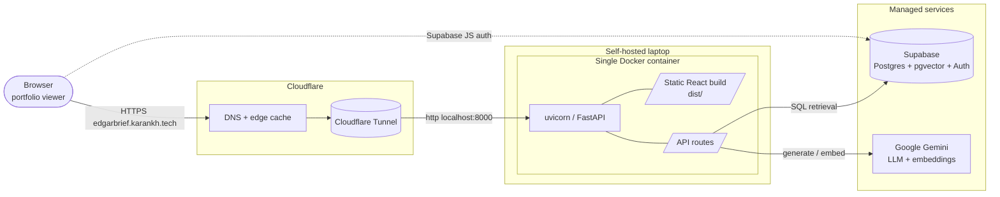
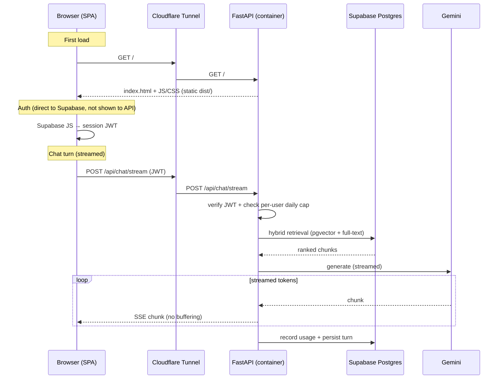

# Deployment Architecture — Single Container (Option A)

Status: **proposed** · Scope: **architecture only** (no implementation in this doc)

This describes how EdgarBrief is deployed for free, low-latency demo access so
potential clients and portfolio viewers can try it. It documents the chosen
**single-container** design and the reasoning behind it.

---

## Goal

Deploy the app so anyone can use it at a public URL with:

- **$0 hosting cost** — only the LLM (Gemini) costs money, and that is bounded.
- **Low latency** for a demo.
- **Frictionless "Try it out"** — login stays, but a viewer can use the app in one
  click without signing up.
- **Bounded spend by construction** — a global daily budget guarantees solvency
  regardless of who the anonymous users are. See *Public demo* below.

## What actually needs hosting

Most of the stack is already managed and off-machine:

| Concern        | Where it lives                          | Cost                     |
| -------------- | --------------------------------------- | ------------------------ |
| Postgres + pgvector + full-text | Supabase (managed)         | Free tier                |
| Auth           | Supabase Auth                           | Free tier                |
| LLM + embeddings | Google Gemini API                     | **Paid** (bounded below) |
| Frontend       | Static bundle (`vite build` → `dist/`)  | Free (served by backend) |
| **Backend**    | FastAPI process — **the only thing that needs a running host** | Free (self-hosted) |

The React frontend is **static files**, not a server: the browser downloads
`dist/` and runs the JS. So the only long-running process to host is the
FastAPI backend.

---

## Decision: one container serves both frontend and API

A single Docker container runs **uvicorn/FastAPI**, which:

- serves the built React SPA (`dist/`) as static files at `/`
- serves the API under a path prefix on the **same origin**
- streams Gemini responses straight to the browser

The container runs on the existing self-hosted laptop and is exposed through the
**existing Cloudflare Tunnel** under one hostname (e.g. `edgarbrief.karankh.tech`).

### Why this design

- **One origin → no CORS.** Frontend and API share a scheme/host/port, so the
  CORS middleware becomes unnecessary.
- **One subdomain, one container, one process** — least to deploy and least to
  break during a live demo.
- **Streaming works with zero config** — there is no intermediate proxy between
  uvicorn and the browser to buffer the SSE stream. (Cloudflare Tunnel passes
  streaming through; it does not buffer.)
- **$0 hosting** — reuses the laptop + Cloudflare Tunnel already running for
  other services. No Vercel, no Railway, no Cloudflare Pages.

### Why not the alternatives

- **Vercel / serverless for the backend** — wrong for a streaming, multi-second
  LLM backend (short timeouts, poor SSE handling).
- **Two containers (web server + backend)** — viable and more "production-shaped"
  (independent rebuilds, nginx/Caddy static serving), but adds a second image, a
  compose file, a reverse-proxy config, and an SSE buffering pitfall (nginx
  buffers by default). Not worth it at demo traffic. See *Future* below.

---

## Deployment topology

Note: the browser talks to Supabase **Auth** directly (via the Supabase JS
client) to obtain a session JWT; the backend verifies that JWT on API calls and
does the data-plane Postgres work itself.

---

## Request flow (including streaming)

---

## Single-origin routing convention

Because one process serves both the UI and the API, paths must not collide. The
intended convention (to be applied during implementation):

- **All API routers mounted under a single `/api` prefix** — e.g.
  `/api/chat/stream`, `/api/threads`, `/api/auth/*`, `/api/health`.
  (Today the routers sit at the root: `/chat`, `/threads`, `/health`, auth.)
- **SPA fallback** — any non-`/api` path returns `index.html` so client-side
  routing (React Router) works on deep links / refresh.
- **Frontend `VITE_API_BASE_URL` becomes relative** (`/api`) instead of an
  absolute backend URL — this is what removes CORS.

This section records the *target* contract; the route-prefix change and static
mount are implementation work, not part of this document.

---

## Cost control (Gemini is paid)

Hosting is free; only Gemini costs money. Kept negligible by:

1. **Cheapest capable model** for generation (Gemini Flash / Flash-Lite tier).
2. **Embeddings are near-free here** — the corpus is embedded once at ingest, not
   per request; only the short user query is embedded at query time.
3. **Hard per-user daily cap**, enforced in the backend *before* the Gemini call,
   keyed on the Supabase user id (e.g. N messages/user/day). This bounds a single
   identity — but for anonymous demo users the real safety valve is the **global
   daily cap** described next.

---

## Public demo: tiered access & cost control

The demo must be open to anyone with **no forced login**, yet **must not be able
to bankrupt the Gemini budget**, even though anonymous users cannot be reliably
identified (IP rotates, VPNs and bots exist).

### Core principle: separate *fairness* from *solvency*

Two jobs that are usually conflated, deliberately kept apart:

| Job | What it does | How strong it must be |
| --- | --- | --- |
| **Fairness** (per-identity quota) | Stops one viewer hogging the demo | **Best-effort.** Allowed to be leaky — it does not protect the wallet. |
| **Solvency** (global daily cap) | Guarantees total spend never exceeds a ceiling | **Airtight.** Does not depend on identifying anyone. |

The financial guarantee rests **only** on the global cap. Anonymous identity is
treated as unreliable on purpose, so the system never depends on it for safety.
An abuser who defeats every per-identity limit still cannot get past the global
cap — worst case, the demo pauses ("back tomorrow") having spent a bounded amount.

### Why this is safe by construction (the cost math)

A demo turn is almost free, which is what makes a low global cap sufficient:

- **Gemini Flash-Lite** + `max_output_tokens` cap (~500) + a few-K-token RAG
  context ≈ a tiny fraction of a cent per turn.
- **Semantic cache** (free — reuses the existing pgvector + embedder) returns
  repeated questions at $0 and millisecond latency.

So even thousands of abusive turns cost single-digit dollars. A **global daily
cap of ~$1–2** makes the worst realistic outcome "the demo paused for the day,"
not a large bill. The defense protects against a $5 surprise, not a $5,000 one.

### Identity: one-click anonymous, no friction

The **"Try it out"** button uses **Supabase Anonymous Auth**:

- One click → silent anonymous sign-in → a real `user.id` + JWT, **zero typing**.
- **Reuses the existing JWT verification path** — quota code keys on `user.id`
  for anonymous and logged-in users alike; no forked auth logic.
- More stable than IP: the id lives in the browser, so it **survives IP changes
  and VPNs** (unlike IP-based identification).

**Known and accepted leak:** the anonymous id lives in browser storage, so
clearing storage / incognito / another browser yields a **new id and a fresh
quota**. This is expected — per-identity quota is fairness, not solvency, and the
global cap bounds the damage regardless.

### Tiered quotas turn the limit into a login funnel

| Tier | Entry | Quota | Rationale |
| --- | --- | --- | --- |
| **Anonymous** ("Try it out") | One click → silent anon auth | Small (e.g. 5–8 turns) | Untrusted, easy-to-farm identity → keep cheap |
| **Logged in** ("Sign in for more") | Full Supabase Auth (email/OAuth) | Larger | Email = accountable, hard-to-farm → safe to be generous |
| **Exhausted** | — | — | 429 → "Sign in to keep exploring" + optional **BYOK** |

Hitting the anonymous limit is a **conversion nudge**, not a dead end. Logged-in
users can be given a larger budget *because* email is the one identity that is
genuinely expensive to farm.

### Bot protection is an optional dial (Turnstile), not a requirement

Because solvency is guaranteed by the global cap, bot mitigation only affects
**availability** (keeping the demo up for real users during a farming attempt),
never solvency. Start without it; enable it if abuse is observed:

| Setting | Friction for real humans | Farming difficulty | Wallet safety |
| --- | --- | --- | --- |
| **No Turnstile, global cap only** *(recommended start)* | Zero — instant | Easy | Safe (cap holds) |
| **Cloudflare Turnstile (managed/invisible)** | Near-zero (silent for humans) | Bots challenged | Safe + farming tedious |
| **Turnstile (interactive)** | One checkbox | Hard | Safe + annoying to farm |

Cloudflare Turnstile in managed mode is **invisible for almost all real users**
(no puzzle); only bot-like clients are challenged. Supabase can attach Turnstile
to its sign-in endpoint, so each *new* anonymous identity costs a (usually
invisible) check — making cache-clearing loops tedious without taxing genuine
visitors. Turnstile is a script tag + config, addable later without rearchitecture.

### Cost reducers that double as implicit limits

- **Gemini Flash-Lite** as the generation model.
- **`max_output_tokens`** cap + concise system prompt + rolling conversation
  summary (prevents input cost compounding across turns).
- **Semantic cache** in the existing pgvector store: embed the incoming query,
  return a cached answer when cosine similarity is very high (≈0.97). Cache hits
  cost $0 and skip the LLM entirely.

### Demo request pipeline

### Where each control lives

- **Global cap, per-identity quota, semantic cache** — enforced **in FastAPI**
  before/around the Gemini call (no edge compute in this stack). Counters stored
  in **Postgres** via atomic upsert (reuses Supabase; no Redis/Upstash needed —
  the persistent process and low demo traffic don't require them).
- **Anonymous identity** — Supabase Anonymous Auth (frontend) + existing backend
  JWT verification.
- **Turnstile** (if enabled) — Cloudflare edge + Supabase sign-in CAPTCHA hook.

### Residual risk (accepted)

A determined attacker can still pass Turnstile repeatedly, rotate anonymous
identities, and consume the **global daily budget** — making the demo briefly
unavailable to others until reset. This is a **denial of availability, not a
financial loss**, and is an acceptable failure mode for a portfolio demo. The
global cap is a single config value that can be raised or lowered as needed.

---

## Latency notes

- The dominant latency is **Gemini generation** (seconds) — hosting location
  cannot improve that.
- The location-sensitive cost is the **backend ↔ Supabase round-trips** during
  hybrid retrieval. Keep the container and the Supabase **region** close.
  - Supabase near the laptop (e.g. Mumbai/Singapore) → self-hosting is ideal.
  - Supabase far away → consider moving the Supabase region, or relocating the
    container to a host near Supabase.
- Cloudflare edge-caches the static assets by header, so first-paint stays fast
  globally even though the origin is a home laptop.

---

## Operational dependencies

- The laptop must stay on (this is the reliability trade-off accepted for $0).
- The Cloudflare Tunnel adds a hostname route to the container's local port.
- Supabase Auth **redirect/allowed URLs** must include the public domain.

---

## Future / not in scope

If demand or goals change, the natural next step is **Option B**: split into two
containers — a static web server (Caddy preferred over nginx, for default
non-buffered streaming) reverse-proxying `/api` to a separate backend container —
or split hosts entirely (frontend → Cloudflare Pages, backend → Railway/Fly near
Supabase). The `/api` prefix convention above makes that split a drop-in change.
