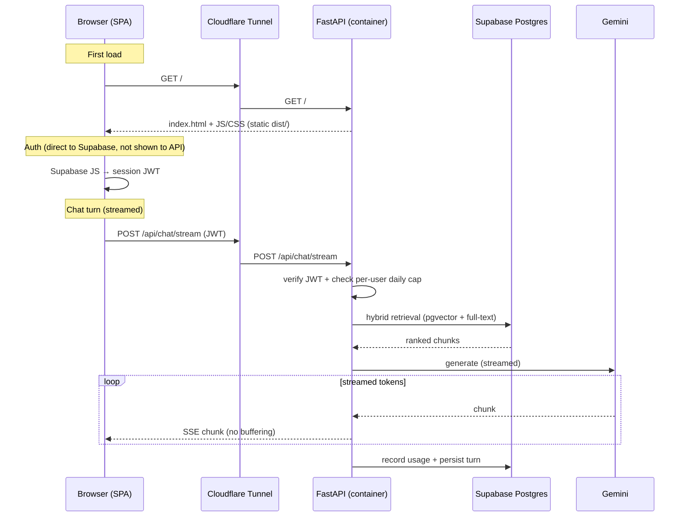
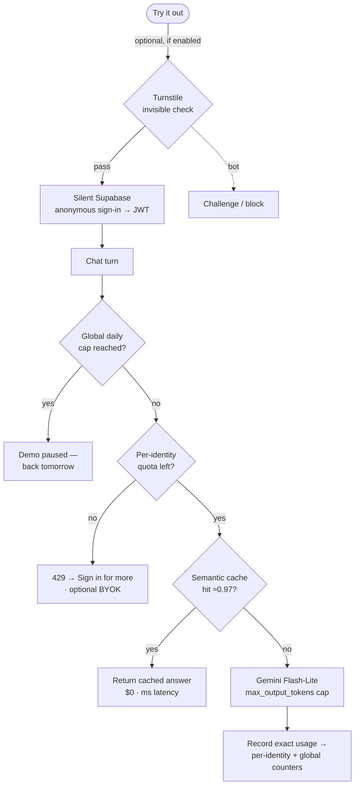

# Deployment Architecture — Single Container (Option A)

Status: **Phase A live** · **Phase B implemented** · Phase C planned. Includes the
as-built operations runbook (bottom).

This describes how EdgarBrief is deployed for free, low-latency demo access so
potential clients and portfolio viewers can try it. It documents the chosen
**single-container** design and the reasoning behind it.

---

## Implementation status

- ✅ **Phase A — Live.** Single container (FastAPI serves the SPA + API), `/api`
  routing, two-stage Dockerfile, push-to-deploy via self-hosted runner, warm DB
  pool, Cloudflare Tunnel on `edgarbrief.karankh.tech`, Supabase migrated to
  **Mumbai (`ap-south-1`)** (measured warm query ~27 ms). See *Operations runbook*.
- ✅ **Phase B — Implemented** (branch `feat/cost-controls`; ships on merge to
  `deploy/single-container`). **Per-user lifetime token cap** + **global monthly
  demo cap** (N distinct users/month, auto-resets) + **`max_output_tokens`** cap,
  all `.env`-configurable. Keyed on the logged-in `user.id` — **login is still
  required**.
- ⏳ **Phase C — Not built.** The *Public demo* section below is the **target**
  design: anonymous one-click "Try it out", tiered anon-vs-logged-in quotas,
  Cloudflare Turnstile, semantic cache, BYOK. Marked inline as ⏳ where relevant.

---

## Goal

Deploy the app so anyone can use it at a public URL with:

- **$0 hosting cost** — only the LLM (Gemini) costs money, and that is bounded.
- **Low latency** for a demo.
- **Frictionless "Try it out"** — login stays, but a viewer can use the app in one
  click without signing up.
- **Bounded spend by construction** — a global daily budget guarantees solvency
  regardless of who the anonymous users are. See *Public demo* below.

## What actually needs hosting

Most of the stack is already managed and off-machine:

| Concern        | Where it lives                          | Cost                     |
| -------------- | --------------------------------------- | ------------------------ |
| Postgres + pgvector + full-text | Supabase (managed)         | Free tier                |
| Auth           | Supabase Auth                           | Free tier                |
| LLM + embeddings | Google Gemini API                     | **Paid** (bounded below) |
| Frontend       | Static bundle (`vite build` → `dist/`)  | Free (served by backend) |
| **Backend**    | FastAPI process — **the only thing that needs a running host** | Free (self-hosted) |

The React frontend is **static files**, not a server: the browser downloads
`dist/` and runs the JS. So the only long-running process to host is the
FastAPI backend.

---

## Decision: one container serves both frontend and API

A single Docker container runs **uvicorn/FastAPI**, which:

- serves the built React SPA (`dist/`) as static files at `/`
- serves the API under a path prefix on the **same origin**
- streams Gemini responses straight to the browser

The container runs on the existing self-hosted laptop and is exposed through the
**existing Cloudflare Tunnel** under one hostname (e.g. `edgarbrief.karankh.tech`).

### Why this design

- **One origin → no CORS.** Frontend and API share a scheme/host/port, so the
  CORS middleware becomes unnecessary.
- **One subdomain, one container, one process** — least to deploy and least to
  break during a live demo.
- **Streaming works with zero config** — there is no intermediate proxy between
  uvicorn and the browser to buffer the SSE stream. (Cloudflare Tunnel passes
  streaming through; it does not buffer.)
- **$0 hosting** — reuses the laptop + Cloudflare Tunnel already running for
  other services. No Vercel, no Railway, no Cloudflare Pages.

### Why not the alternatives

- **Vercel / serverless for the backend** — wrong for a streaming, multi-second
  LLM backend (short timeouts, poor SSE handling).
- **Two containers (web server + backend)** — viable and more "production-shaped"
  (independent rebuilds, nginx/Caddy static serving), but adds a second image, a
  compose file, a reverse-proxy config, and an SSE buffering pitfall (nginx
  buffers by default). Not worth it at demo traffic. See *Future* below.

---

## Deployment topology


Note: the browser talks to Supabase **Auth** directly (via the Supabase JS
client) to obtain a session JWT; the backend verifies that JWT on API calls and
does the data-plane Postgres work itself.

---

## Request flow (including streaming)



---

## Single-origin routing convention ✅ implemented

Because one process serves both the UI and the API, paths must not collide. The
convention now in place:

- ✅ **All API routers mounted under a single `/api` prefix** — `/api/chat/stream`,
  `/api/threads`, `/api/health`, auth (`backend/app/main.py`).
- ✅ **SPA fallback** — any non-`/api` path returns `index.html` (catch-all in
  `main.py`, active when `FRONTEND_DIST` is set) so React Router deep links /
  refresh work.
- ✅ **Frontend `VITE_API_BASE_URL` is relative** (`/api`); a Vite dev proxy
  forwards `/api` to the backend in dev. Same-origin in prod removes CORS.

---

## Cost control (Gemini is paid)

Hosting is free; only Gemini costs money. Kept negligible by:

1. ✅ **Cheapest capable model** for generation (live model `gemini-3.1-flash-lite`).
2. ✅ **Embeddings are near-free here** — the corpus is embedded once at ingest, not
   per request; only the short user query is embedded at query time.
3. ✅ **`max_output_tokens` cap** on the model (`MAX_OUTPUT_TOKENS`).
4. ✅ **Per-user + global caps** enforced in the backend *before* the Gemini call
   (`app/quota`, keyed on `user.id`). As shipped (Phase B): a **per-user lifetime
   token budget** (never resets) plus a **global cap of N distinct demo users per
   calendar month** (auto-resets) — the latter is the bankruptcy stop. See the
   *Public demo* section for the broader target design.

---

## Public demo: tiered access & cost control

> **Status:** this section is the **target** design. **Shipped today (Phase B):**
> per-user lifetime token cap + global monthly demo cap + `max_output_tokens`,
> keyed on the logged-in `user.id` — **login is still required**. **Not yet built
> (Phase C):** anonymous "Try it out", tiered anon-vs-logged-in quotas, Turnstile,
> semantic cache, BYOK. Items below are tagged ✅ (shipped) / ⏳ (planned).

The demo must be open to anyone with **no forced login**, yet **must not be able
to bankrupt the Gemini budget**, even though anonymous users cannot be reliably
identified (IP rotates, VPNs and bots exist).

### Core principle: separate *fairness* from *solvency*

Two jobs that are usually conflated, deliberately kept apart:

| Job | What it does | How strong it must be |
| --- | --- | --- |
| **Fairness** (per-identity quota) | Stops one viewer hogging the demo | **Best-effort.** Allowed to be leaky — it does not protect the wallet. |
| **Solvency** (global daily cap) | Guarantees total spend never exceeds a ceiling | **Airtight.** Does not depend on identifying anyone. |

The financial guarantee rests **only** on the global cap. Anonymous identity is
treated as unreliable on purpose, so the system never depends on it for safety.
An abuser who defeats every per-identity limit still cannot get past the global
cap — worst case, the demo pauses ("back tomorrow") having spent a bounded amount.

### Why this is safe by construction (the cost math)

A demo turn is almost free, which is what makes a low global cap sufficient:

- **Gemini Flash-Lite** + `max_output_tokens` cap (~500) + a few-K-token RAG
  context ≈ a tiny fraction of a cent per turn.
- **Semantic cache** (free — reuses the existing pgvector + embedder) returns
  repeated questions at $0 and millisecond latency.

So even thousands of abusive turns cost single-digit dollars. A **global daily
cap of ~$1–2** makes the worst realistic outcome "the demo paused for the day,"
not a large bill. The defense protects against a $5 surprise, not a $5,000 one.

### Identity: one-click anonymous, no friction ⏳ (Phase C — not built)

The **"Try it out"** button uses **Supabase Anonymous Auth**:

- One click → silent anonymous sign-in → a real `user.id` + JWT, **zero typing**.
- **Reuses the existing JWT verification path** — quota code keys on `user.id`
  for anonymous and logged-in users alike; no forked auth logic.
- More stable than IP: the id lives in the browser, so it **survives IP changes
  and VPNs** (unlike IP-based identification).

**Known and accepted leak:** the anonymous id lives in browser storage, so
clearing storage / incognito / another browser yields a **new id and a fresh
quota**. This is expected — per-identity quota is fairness, not solvency, and the
global cap bounds the damage regardless.

### Tiered quotas turn the limit into a login funnel ⏳ (Phase C — not built)

| Tier | Entry | Quota | Rationale |
| --- | --- | --- | --- |
| **Anonymous** ("Try it out") | One click → silent anon auth | Small (e.g. 5–8 turns) | Untrusted, easy-to-farm identity → keep cheap |
| **Logged in** ("Sign in for more") | Full Supabase Auth (email/OAuth) | Larger | Email = accountable, hard-to-farm → safe to be generous |
| **Exhausted** | — | — | 429 → "Sign in to keep exploring" + optional **BYOK** |

Hitting the anonymous limit is a **conversion nudge**, not a dead end. Logged-in
users can be given a larger budget *because* email is the one identity that is
genuinely expensive to farm.

### Bot protection is an optional dial (Turnstile), not a requirement ⏳ (Phase C — not built)

Because solvency is guaranteed by the global cap, bot mitigation only affects
**availability** (keeping the demo up for real users during a farming attempt),
never solvency. Start without it; enable it if abuse is observed:

| Setting | Friction for real humans | Farming difficulty | Wallet safety |
| --- | --- | --- | --- |
| **No Turnstile, global cap only** *(recommended start)* | Zero — instant | Easy | Safe (cap holds) |
| **Cloudflare Turnstile (managed/invisible)** | Near-zero (silent for humans) | Bots challenged | Safe + farming tedious |
| **Turnstile (interactive)** | One checkbox | Hard | Safe + annoying to farm |

Cloudflare Turnstile in managed mode is **invisible for almost all real users**
(no puzzle); only bot-like clients are challenged. Supabase can attach Turnstile
to its sign-in endpoint, so each *new* anonymous identity costs a (usually
invisible) check — making cache-clearing loops tedious without taxing genuine
visitors. Turnstile is a script tag + config, addable later without rearchitecture.

### Cost reducers that double as implicit limits

- ✅ **Gemini Flash-Lite** as the generation model.
- ✅ **`max_output_tokens`** cap (concise prompt; rolling-summary is future work).
- ⏳ **Semantic cache** in the existing pgvector store: embed the incoming query,
  return a cached answer when cosine similarity is very high (≈0.97). Cache hits
  cost $0 and skip the LLM entirely. **Not built — explicitly out of scope for now.**

### Demo request pipeline



### Where each control lives

- ✅ **Per-user + global caps** — enforced **in FastAPI** before the Gemini call
  (`app/quota/service.py`), counters in **Postgres** via atomic upsert (`demo_usage`
  table; no Redis/Upstash needed). **Semantic cache** ⏳ not built.
- ⏳ **Anonymous identity** — Supabase Anonymous Auth (frontend) + existing backend
  JWT verification.
- ⏳ **Turnstile** (if enabled) — Cloudflare edge + Supabase sign-in CAPTCHA hook.

### Residual risk (accepted)

A determined attacker can still pass Turnstile repeatedly, rotate anonymous
identities, and consume the **global daily budget** — making the demo briefly
unavailable to others until reset. This is a **denial of availability, not a
financial loss**, and is an acceptable failure mode for a portfolio demo. The
global cap is a single config value that can be raised or lowered as needed.

---

## Latency notes

- The dominant latency is **Gemini generation** (seconds) — hosting location
  cannot improve that.
- The location-sensitive cost is the **backend ↔ Supabase round-trips** during
  hybrid retrieval. Keep the container and the Supabase **region** close.
  - ✅ **Done:** Supabase project migrated from Sydney to **Mumbai (`ap-south-1`)** —
    measured warm `SELECT 1` dropped ~157 ms → **~27 ms** (~6× on per-turn DB time).
- Cloudflare edge-caches the static assets by header, so first-paint stays fast
  globally even though the origin is a home laptop.

---

## Operational dependencies

- The laptop must stay on (this is the reliability trade-off accepted for $0).
- ✅ The Cloudflare Tunnel routes `edgarbrief.karankh.tech` → `host.docker.internal:8000`.
- ⚠️ Supabase Auth **redirect/allowed URLs** must include `https://edgarbrief.karankh.tech`
  (set in Authentication → URL Configuration), or email login redirects break.

---

## Future / not in scope

If demand or goals change, the natural next step is **Option B**: split into two
containers — a static web server (Caddy preferred over nginx, for default
non-buffered streaming) reverse-proxying `/api` to a separate backend container —
or split hosts entirely (frontend → Cloudflare Pages, backend → Railway/Fly near
Supabase). The `/api` prefix convention above makes that split a drop-in change.

---

## Operations runbook (as built)

How the live deploy is actually wired, including the macOS gotchas we hit.

### Push-to-deploy
- A **GitHub Actions self-hosted runner** runs on the server (`runs-on: self-hosted`,
  installed as a launchd service via the runner's `./svc.sh install && ./svc.sh start`).
- `.github/workflows/deploy.yml` triggers on push to `deploy/single-container`:
  restore env files → `docker compose --env-file frontend/.env build` →
  `alembic upgrade head` → `docker compose up -d` → prune.
- The runner polls GitHub outbound, so no inbound port is exposed for CI.

### Secrets on the server (never in git)
Kept in `~/edgarbrief/secrets/` and copied into the workspace by the workflow:
- `backend.env` → `backend/.env` (runtime secrets, incl. the Phase B demo limits).
- `frontend.env` → `frontend/.env` (public build values).
Override the location with `SECRETS_DIR` on the runner.

### Cloudflare Tunnel
- Reuses the existing `cloudflared` container (shared with n8n). Added a public
  hostname `edgarbrief.karankh.tech` → service **`http://host.docker.internal:8000`**
  (cloudflared is on a different Docker network, so it reaches the published host
  port, not a compose service name).

### Supabase
- After pointing the domain, set **Authentication → URL Configuration**:
  Site URL `https://edgarbrief.karankh.tech` + redirect URLs (`…/**`), or email
  login redirects break.

### macOS-specific gotchas (already fixed, documented so they're not re-hit)
- **Docker keychain:** the launchd-run runner can't reach the login keychain, so
  Docker's credential helper failed on image pulls. Fix: remove `credsStore` from
  `~/.docker/config.json` (only public images are pulled, so no creds are needed).
- **ghcr 403:** anonymous pulls of `ghcr.io/astral-sh/uv` failed from the runner;
  the Dockerfile installs `uv` from **PyPI** instead, keeping the build to Docker
  Hub + PyPI.
- **Runner architecture:** the server is Apple Silicon — use the **arm64** runner
  package, not x64.

### Test the container locally before wiring CI
```
docker compose --env-file frontend/.env build && docker compose up -d
# open http://<host>:8000  → SPA loads, /api/health → {"status":"ok"}
```
